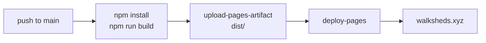
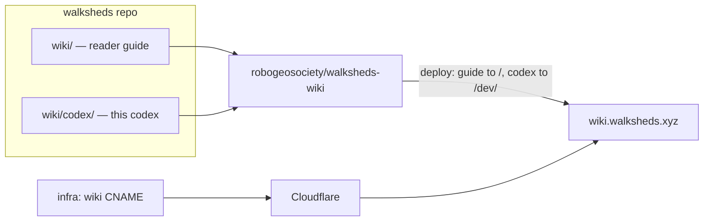

# Deployment + DNS

Walksheds is a static site on GitHub Pages with a Cloudflare-managed custom domain. This codex is a second, sibling site on its own subdomain.

## The main app

`.github/workflows/deploy.yml` builds and deploys on every push to `main`:



The build injects `VITE_MAPBOX_ACCESS_TOKEN` from the `MAPBOX_ACCESS_TOKEN` secret. The job uses `concurrency: { group: pages }` so deploys serialize — the latest finished deploy wins.

### Custom domain

`public/CNAME` contains `walksheds.xyz`. Vite copies everything in `public/` into `dist/` at build time, so the CNAME lands in the artifact and GitHub Pages reads it on deploy.

### Branch previews

To preview a branch on the live URL (overriding main until the next main push), add a per-branch workflow file under `.github/workflows/deploy-preview-<sanitized>.yml`:

1. Sanitize the branch name: `/` → `-`, strip anything outside `[a-zA-Z0-9._-]`.
2. Model it on an existing preview file: `on.push.branches: ['<exact-branch>']` + `workflow_dispatch`, `concurrency.group: pages` (shared with `deploy.yml` so they serialize), and the same build + upload + deploy jobs.
3. Commit and push to the branch — it fires and replaces the live site.
4. `cleanup-merged-preview.yml` on main deletes the file on PR merge, so previews don't accumulate.

The next push to `main` re-deploys main's build and overwrites the preview.

## Cloudflare DNS (Terraform)

DNS for `walksheds.xyz` lives in the `infra/` Terraform module. The Cloudflare provider authenticates with an API token (`var.cloudflare_api_token`, kept in a gitignored `terraform.tfvars`), looks up the zone by name, and manages the records and HTTPS settings.

| Record | Type | Target | Proxied |
| --- | --- | --- | --- |
| `@` (apex) | CNAME (flattened) | `tommyroar.github.io` | yes |
| `www` | CNAME | `walksheds.xyz` | yes |
| `wiki` | CNAME | `tommyroar.github.io` | yes |

Plus zone settings: `ssl = full`, `always_use_https = on`, `min_tls_version = 1.2`. Apply changes with:

```bash
cd infra
terraform plan
terraform apply
```

## The docs site — one Pages site, two MkDocs projects

Walksheds has one documentation site alongside the app: the reader **guide** at `wiki.walksheds.xyz`, with this **codex** served as a subpage at `wiki.walksheds.xyz/dev/`. Both are MkDocs Material projects authored in the main `walksheds` repo (`wiki/` and `wiki/codex/`) and published from a single Pages repo, `robogeosociety/walksheds-wiki`.

| Site | URL | Audience | Source dir |
| --- | --- | --- | --- |
| Guide | `wiki.walksheds.xyz` | readers, riders, advocates | `wiki/` |
| Codex (this) | `wiki.walksheds.xyz/dev/` | engineers, contributors | `wiki/codex/` |



How it wires up:

- **One DNS record** — the `wiki` CNAME (proxied, Universal SSL) in `infra/main.tf`, applied with Terraform. (There is no second subdomain: a proxied *second-level* name like `dev.wiki` isn't covered by Cloudflare's `*.walksheds.xyz` Universal SSL, so the codex is a subpath instead.)
- **One deploy** — `wiki/.github/workflows/deploy.yml` builds the guide with `mkdocs build --strict` to `site/`, then builds the codex with `mkdocs build --strict -f codex/mkdocs.yml -d site/dev`, and deploys the combined `site/`. The guide's `docs/CNAME` carries `wiki.walksheds.xyz`.

!!! note "Operator steps live outside this repo"
    Creating the `walksheds-wiki` Pages repo, enabling Pages, and running `terraform apply` are manual steps that touch GitHub and the Cloudflare token. The runbook is tracked as a human task in the dev vault.

### Editing the docs locally

```bash
cd wiki          # the reader guide;  cd wiki/codex  for this codex
pip install -r requirements.txt
mkdocs serve                      # live preview at http://127.0.0.1:8000
mkdocs build --strict             # what CI runs; fails on broken links

# preview exactly as deployed (codex under /dev/), from wiki/:
mkdocs build -d site && mkdocs build -f codex/mkdocs.yml -d "$PWD/site/dev"
```
