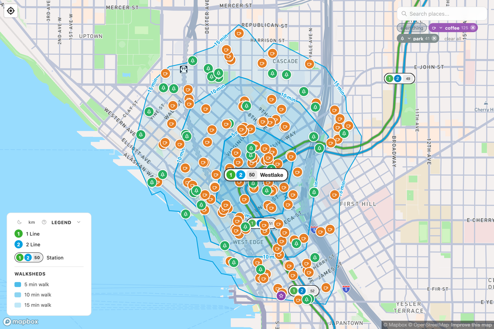

# Welcome to the Walksheds Guide

This is a friendly companion to **[walksheds.xyz](https://walksheds.xyz)** — a map of everywhere you can reach on foot from a Seattle Link light rail station.

A **walkshed** is simply the area you can walk to in a given time. Stand at a station, start a stopwatch, and walk in every direction until the time runs out — the shape you trace is the walkshed. Walksheds draws three of them around each station: a 5-minute walk, a 10-minute walk, and a 15-minute walk.

This guide explains what that means and why it matters, shows you how to read the map, and tells the story of the stations themselves — including when each one opened.

<figure markdown="span">
  { loading=lazy }
  <figcaption>Westlake station on the live map — the three nested walksheds and every place inside the 15-minute walk.</figcaption>
</figure>

38stations

2lines

15minute walk, mapped

2009first trains ran

## Start here

- :material-walk: **[What is a walkshed?](walkability.md)** — why a 15-minute walk is the unit that matters, in plain terms.
- :material-map-search: **[Using the app](using-the-app.md)** — how to read the bands, the station pills, and the exits on walksheds.xyz.
- :material-train: **[The Seattle Link guide](link-guide/index.md)** — the 1 and 2 Lines, when each station opened, and what's a short walk away.
- :material-clock-plus: **[Future lines](link-guide/future.md)** — West Seattle, Ballard, Tacoma, Everett, and what's still being built.

!!! tip "The shortest version"
    Frequent transit plus a walkable neighborhood around each stop is what makes a train line actually useful. Walksheds makes that walkable area visible — one station at a time. Open the [map](https://walksheds.xyz), pick a station, and see for yourself.

---

*This is the reader's guide. If you're a developer and want to know how the map is built — the data pipelines, the invariants, the design system — see the engineering codex at [dev.wiki.walksheds.xyz](https://dev.wiki.walksheds.xyz).*
