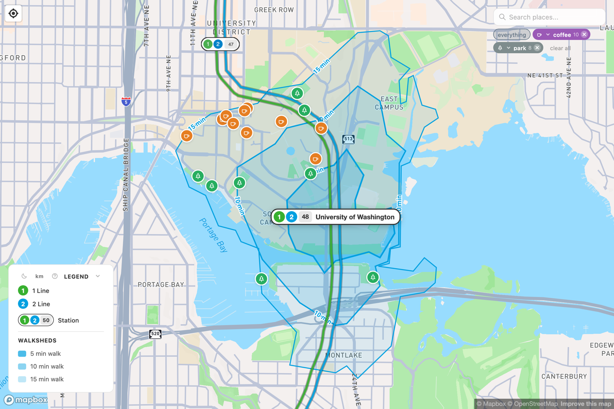

# 1 Line station openings 1

Every 1 Line station in the order it opened — the order the line actually grew in — with what's a short walk away. Open any of these on the [map](https://walksheds.xyz) to see the real walkshed.

Stations marked 12 are on the shared spine and are also served by the [2 Line](line-2.md).

## 2009-07-18 — the first trains

Central Link opened between downtown Seattle and Tukwila, instantly connecting downtown to the Rainier Valley.

| Station | Lines | A short walk away |
| --- | --- | --- |
| Westlake `50` | 12 | The downtown retail core, Westlake Center, the monorail; Pike Place Market is a longer stroll. |
| Symphony `51` | 12 | Benaroya Hall and the Seattle Symphony, the downtown office core, the central library. |
| Pioneer Square `52` | 12 | Seattle's oldest neighborhood — historic brick blocks, Smith Tower, galleries, the ferry terminal. |
| International District/Chinatown `53` | 12 | The Chinatown-International District, Uwajimaya, Seattle's busiest transit hub; the stadiums are close. |
| Stadium `54` | 1 | Lumen Field and T-Mobile Park — the football and baseball stadiums. |
| SODO `55` | 1 | The SODO industrial district, Starbucks headquarters, warehouses and makers. |
| Beacon Hill `56` | 1 | The heart of Beacon Hill, reached by deep elevators; Jefferson Park is nearby. |
| Mount Baker `57` | 1 | The Mount Baker hub on Rainier Avenue, Franklin High School. |
| Columbia City `58` | 1 | One of the most walkable stops on the line — Columbia City's historic business district and farmers market. |
| Othello `60` | 1 | The Othello and New Holly neighborhoods, among the most diverse in Seattle. |
| Rainier Beach `61` | 1 | The Rainier Beach neighborhood; Kubota Garden is a walk to the east. |
| Tukwila International Blvd `63` | 1 | Elevated beside International Boulevard, with hotels and bus connections. |

## 2009-12-19 — to the airport

| Station | Lines | A short walk away |
| --- | --- | --- |
| Airport / SeaTac `64` | 1 | A covered walkway leads straight into Sea-Tac airport's terminal. |

## 2016-03-19 — under the ship canal

<figure markdown="span">
  { loading=lazy }
  <figcaption>University of Washington — the campus, Husky Stadium, and Montlake inside the walkshed.</figcaption>
</figure>

| Station | Lines | A short walk away |
| --- | --- | --- |
| University of Washington `48` | 12 | The UW campus and Husky Stadium, Montlake, the Burke-Gilman Trail. |
| Capitol Hill `49` | 12 | Seattle's densest, liveliest neighborhood — Broadway, Cal Anderson Park, nightlife in every direction. |

## 2016-09-24 — south to Angle Lake

| Station | Lines | A short walk away |
| --- | --- | --- |
| Angle Lake `65` | 1 | A park-and-ride near Angle Lake Park; for years this was the southern end of the line. |

## 2021-10-02 — Northgate Link

| Station | Lines | A short walk away |
| --- | --- | --- |
| U District `47` | 12 | The University District and "the Ave," dense student housing, the north edge of campus. |
| Roosevelt `46` | 12 | The Roosevelt neighborhood and high school; Green Lake is a walk to the west. |
| Northgate `45` | 12 | The redeveloped Northgate area, the Kraken's practice arena, a pedestrian bridge to North Seattle College. |

## 2024-08-30 — Lynnwood Link

Four shared stations extended the north end into Snohomish County.

| Station | Lines | A short walk away |
| --- | --- | --- |
| Shoreline South/148th `43` | 12 | A Shoreline residential area set for transit-oriented growth. |
| Shoreline North/185th `42` | 12 | North Shoreline neighborhoods and a major bus transfer point. |
| Mountlake Terrace `41` | 12 | The Mountlake Terrace town center and a large transit center. |
| Lynnwood City Center `40` | 12 | The northern end of Link — the Lynnwood Transit Center, with bus connections toward Everett. |

## 2025-12-06 — Federal Way Link

Three stations pushed the south end into Federal Way, opening ahead of schedule.

| Station | Lines | A short walk away |
| --- | --- | --- |
| Kent Des Moines `66` | 1 | Near Highline College, between Kent and Des Moines. |
| Star Lake `67` | 1 | A park-and-ride serving the Star Lake area. |
| Federal Way Downtown `68` | 1 | The current southern end of Link — downtown Federal Way and The Commons. |

---

*Opening dates are confirmed against Sound Transit announcements and Wikipedia's station records. For the 2 Line's openings, see [2 Line station openings](line-2-openings.md).*
