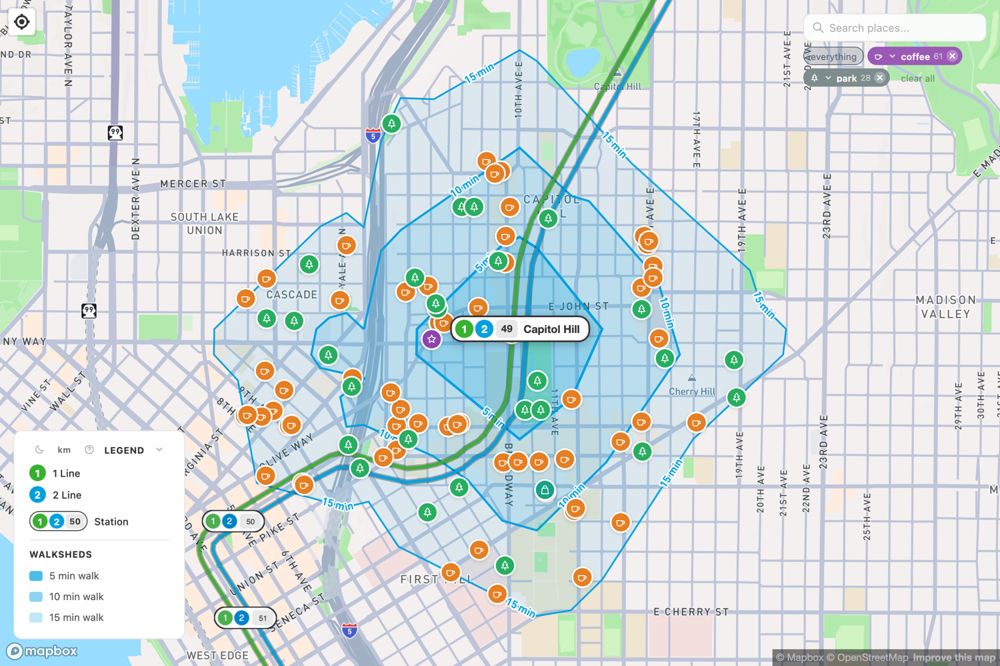

# The 1 Line 1

The 1 Line is the original Link line and the longer of the two — a north–south route from **Lynnwood City Center** through downtown Seattle, down the Rainier Valley, past the airport, to **Federal Way Downtown**.

!!! info "At a glance"
    **Runs:** Lynnwood ↔ Federal Way · **Stations:** 26 · **Opened:** 2009, extended through 2025 · **Color:** green

## The shape of the line

Coming from the north, the 1 Line runs elevated and in tunnel through Snohomish County and north Seattle — Lynnwood, Mountlake Terrace, the two Shoreline stations, Northgate, Roosevelt, U District — then dives underground for the busiest stretch: the University of Washington, Capitol Hill, and the downtown transit tunnel (Westlake, Symphony, Pioneer Square, International District).

South of downtown it surfaces in SODO, climbs through a deep tunnel under **Beacon Hill**, then runs at street level and elevated down the **Rainier Valley** — Mount Baker, Columbia City, Othello, Rainier Beach — some of the most diverse neighborhoods in the state. From there it's on to Tukwila, a skybridge straight into **SeaTac airport**, and the southern extensions through Angle Lake to Kent and Federal Way.

## Where the walksheds are richest

The 1 Line shows the biggest contrast between station types:

- **Dense, gridded, walkable** — Capitol Hill, U District, Columbia City, the downtown stations. Their walksheds fill quickly with homes, shops, and front doors.
- **Built around a park-and-ride or a highway** — Tukwila International Blvd, Star Lake, Angle Lake. The walkshed is real but thinner, because more of it is parking, freeway, or low-density edges.

Comparing two stops on the same line is the quickest way to feel what [walkability](../walkability.md) means in practice.

<figure markdown="span">
  { loading=lazy }
  <figcaption>Capitol Hill — one of the densest, most walkable stops on the 1 Line.</figcaption>
</figure>

## The shared spine

From **Lynnwood** down to **International District/Chinatown**, the 1 Line shares its 13 northern stations with the [2 Line](line-2.md) — either line stops there. South of International District, the 1 Line continues alone.

---

See **[station openings](line-1-openings.md)** for every 1 Line station in the order it opened, with its date and what's a short walk away.
