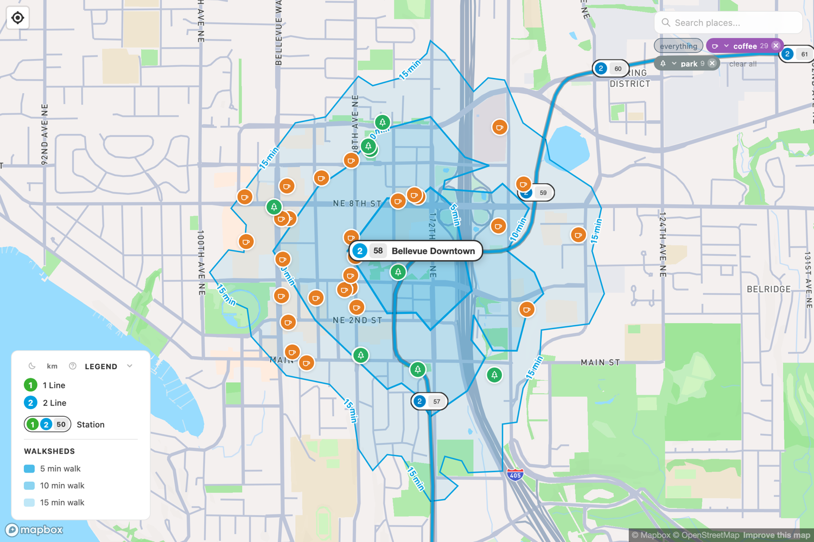

# The 2 Line 2

The 2 Line connects Seattle to the **Eastside** — Mercer Island, Bellevue, and Redmond — across Lake Washington. Its most remarkable feature is *how* it crosses: on the **Interstate 90 floating bridge**, the first light rail in the world to run on a floating bridge.

!!! info "At a glance"
    **Runs:** Lynnwood ↔ Downtown Redmond (via Seattle and the I-90 bridge) · **Color:** blue · **Began:** 2024 as an isolated Eastside line; joined to Seattle in 2026

## A line that opened backwards

Most Link extensions grew outward from Seattle. The 2 Line did the opposite. It first opened in 2024 as an **isolated starter line** entirely on the Eastside — eight stations from South Bellevue to Redmond Technology, with no connection to Seattle at all. Riders used it within Bellevue and Redmond while the hardest piece, the floating-bridge crossing, was still being finished and tested.

That crossing — the **"Crosslake Connection"** through Mercer Island and Judkins Park — opened in March 2026, finally joining the Eastside to downtown Seattle and the [shared spine](line-1.md) up to Lynnwood. A separate extension had already pushed the east end past Redmond Technology to **Downtown Redmond**.

## What the walksheds look like

The Eastside stations are a study in transformation. Several sit in areas being rebuilt around the train as it arrives:

- **Spring District/120th** and **Bel-Red/130th** anchor former light-industrial land that's filling in with apartments and offices.
- **Bellevue Downtown** opens onto one of the densest downtowns in the state outside Seattle.
- **Redmond Technology** and **Overlake Village** sit at the edge of the Microsoft campus.
- **South Bellevue** and **Mercer Island** lean more on park-and-ride and bus connections, so their walksheds are quieter.

It's a live look at [transit-oriented development](../walkability.md) — neighborhoods being built to fill the walkshed, in real time.

<figure markdown="span">
  { loading=lazy }
  <figcaption>Bellevue Downtown — the densest downtown in the state outside Seattle, all within the 2 Line's walkshed.</figcaption>
</figure>

---

See **[station openings](line-2-openings.md)** for every 2 Line station in the order it opened, with its date and what's a short walk away.
