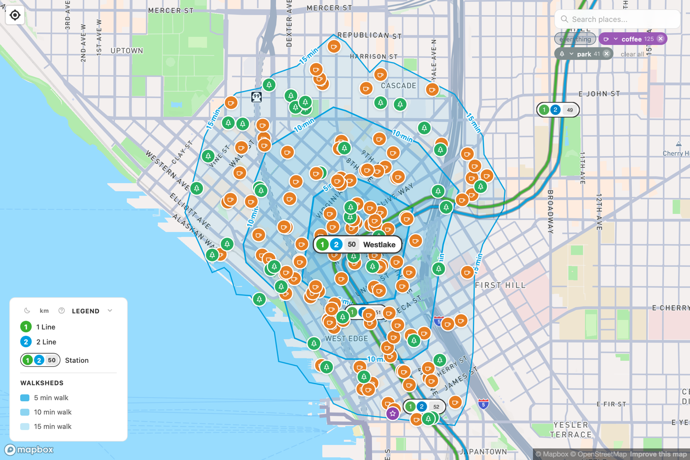
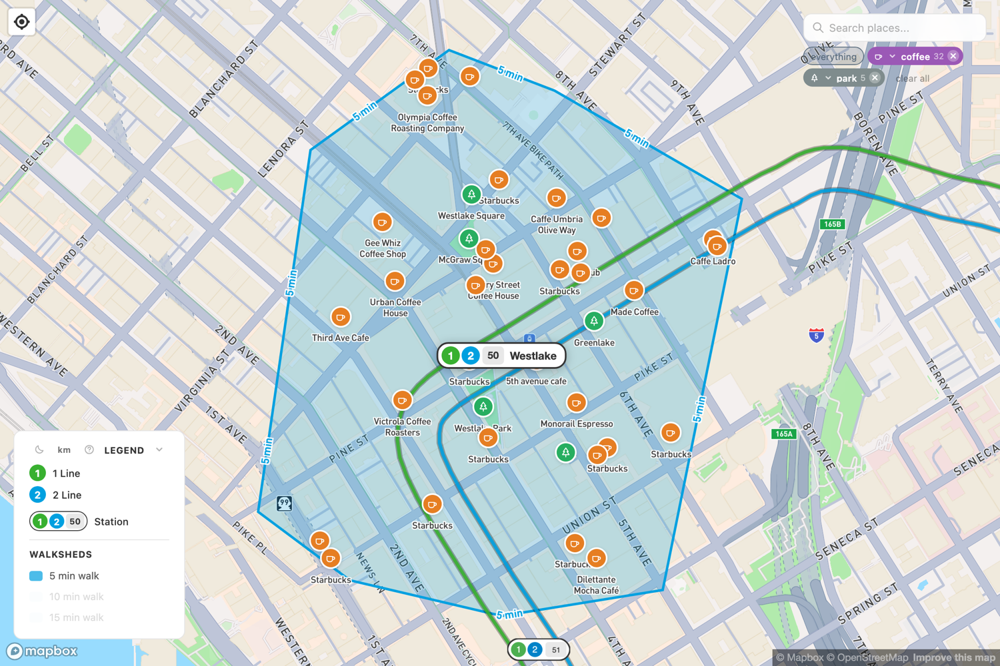
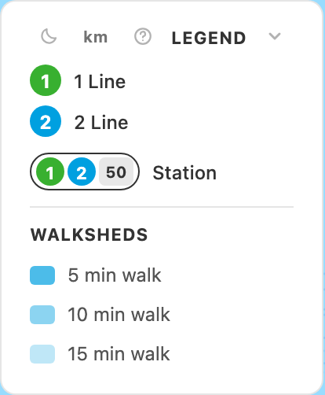
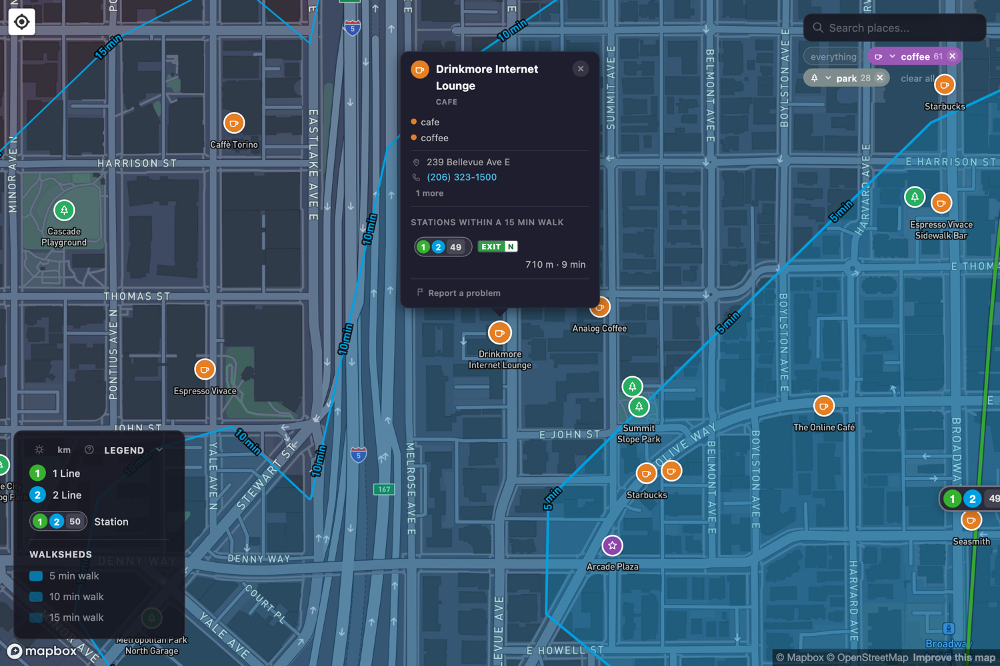
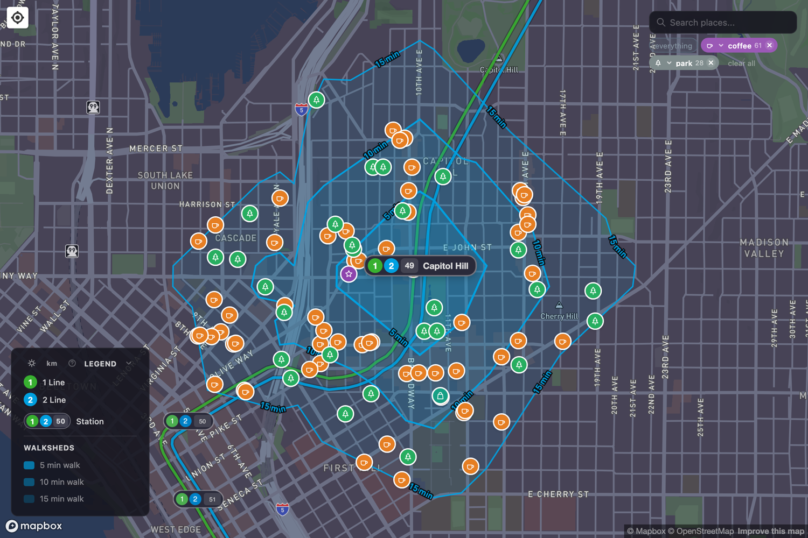
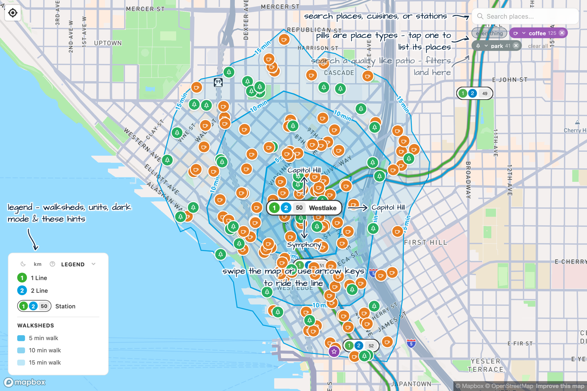

# Using the app

Everything here refers to the live map at **[walksheds.xyz](https://walksheds.xyz)**. You don't need an account or an app — it runs in any browser.

## Pick a station

Tap or click any station on the map. Its three walksheds appear as nested shaded areas, and the points of interest inside them light up. You can also step along a line — the map supports moving station to station with the keyboard arrows or a swipe, following the route like beads on a string.

<figure markdown="span">
  { loading=lazy }
  <figcaption>A station selected: walkshed bands, the labelled station pill, and the points of interest inside.</figcaption>
</figure>

## Read the bands

The three shaded areas are the walksheds, shown densest nearest the station:

- The **innermost, strongest** shade is the 5-minute walk.
- The **middle** shade is the 10-minute walk.
- The **faint outer** shade is the 15-minute walk.

The shading uses the Link line color — blue on the light map, green on the dark map. In the legend you can toggle any of the three bands on or off if you only care about, say, the 5-minute reach.

<figure markdown="span">
  { loading=lazy }
  <figcaption>Just the 5-minute band switched on — the immediate doorstep of the station. (The chips up top also filter the dots; here, coffee and parks.)</figcaption>
</figure>

## The station pill

Each station is labeled with a **pill** — the same vocabulary Sound Transit uses on its own maps:

- A colored **roundel** for each line that stops there: 1 for the 1 Line, 2 for the 2 Line. A station served by both shows both.
- The two-digit **stop code** (Westlake is `50`; the numbers climb as you head south and east).

So Westlake reads as 1 2 `50` — both lines, stop 50.

<figure markdown="span">
  { loading=lazy }
  <figcaption>The legend spells out the vocabulary: line roundels, the station pill, and the three walkshed bands.</figcaption>
</figure>

## Points of interest

The dots inside the walkshed are **points of interest** — restaurants, cafes, bars, shops, museums, parks, and more, drawn from OpenStreetMap and Overture Maps. Tap one and a popup tells you:

- What it is and a few details (hours, website, and so on, when known).
- **The stations within a 15-minute walk**, each with the *real* walking distance and time — not a straight line, but the actual route on the sidewalk network.

<figure markdown="span">
  { loading=lazy }
  <figcaption>Tap a dot for its details and the stations within a 15-minute walk — each with the real walking distance and the best exit to use.</figcaption>
</figure>

You can filter the dots by category and by tag, so you can ask the map things like "where are the bakeries within a 15-minute walk of Capitol Hill?"

## EXIT badges

When a station is selected, small green **EXIT** badges float over its real-world entrances, labeled by direction or exit number. Open a point of interest's popup and the exit physically closest to it turns orange — the "best exit" to leave from if that place is where you're headed. (Not every station has its exits mapped yet; the newest ones may show none.)

## Comfort controls

In the legend you'll find:

- A **dark mode** toggle (sun / moon).
- A **units** toggle — switch distances between miles/feet and kilometers/meters.
- A **hints** button (the `?`) that explains the on-map controls.
- The **open-book** icon, which opens this guide.
- The three **walkshed band** toggles.

The legend itself collapses to a slim bar if you want more map and less chrome.

<figure markdown="span">
  { loading=lazy }
  <figcaption>Dark mode — the base map shifts to dusk and the walksheds switch to the green accent.</figcaption>
</figure>

The hints button (`?`) brings up a quick set of on-map annotations explaining each control — handy on a first visit:

<figure markdown="span">
  { loading=lazy }
  <figcaption>The hints overlay, pointing out the search, the filter chips, the legend, and how to ride the line.</figcaption>
</figure>

!!! tip "A good first exercise"
    Select your home station, switch on just the 15-minute band, and tap a few dots to see how far the walk really is. Then compare a dense, gridded station like [Capitol Hill](link-guide/line-1-openings.md) with a park-and-ride station — the difference in how much the walkshed *reaches* is the whole story of [why walksheds matter](walkability.md).
