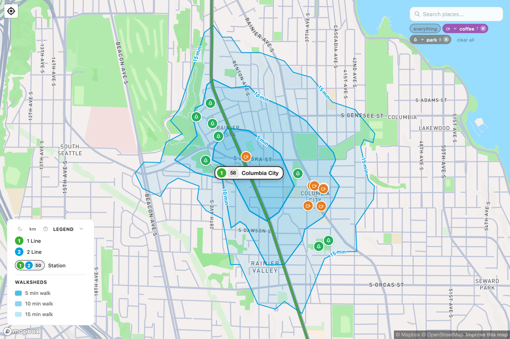

# What is a walkshed?

A **walkshed** is the area you can reach on foot from a place within a set amount of time. It's the walking version of a watershed — instead of where the rain flows, it's where your feet can carry you.

Walksheds draws three around each Link station:

- The **5-minute** walk — the immediate doorstep of the station.
- The **10-minute** walk — a comfortable stroll.
- The **15-minute** walk — about three-quarters of a mile for most people, and the outer edge of what counts as "walking distance" to transit.

These shapes are rarely circles. A freeway, a steep hill, a lake, or a missing sidewalk all bend the walkshed inward, because you can only go where there's actually a path. That's the whole point of mapping them instead of just drawing a ring.

<figure markdown="span">
  { loading=lazy }
  <figcaption>Columbia City — a gridded, walkable neighborhood, so the walkshed fills quickly with destinations.</figcaption>
</figure>

## Why 15 minutes?

Fifteen minutes is roughly how far most people will walk to a train without thinking twice. Past that, ridership drops off sharply — people drive, or don't go at all. So the 15-minute walkshed is a good proxy for a simple question: **how many homes, jobs, shops, and parks does this station actually serve?**

Two stations can look identical on a transit map and serve wildly different places. One might open onto a dense, gridded neighborhood full of front doors; the next might sit in a sea of parking next to a highway. The walkshed is what tells them apart.

## Why it matters

A train is only as useful as the places you can reach at either end of the trip. Frequent service gets you *there fast*; a walkable area around the station is what makes *there* worth going. When both line up, you get a neighborhood where a car is optional instead of mandatory.

This is the core idea behind **transit-oriented development** — building homes and shops within a short walk of frequent transit, so that the walkshed fills up with destinations. A bigger, denser, better-connected walkshed means:

- More people can reach the train without a car.
- More trips are possible without driving — which means less traffic, lower emissions, and lower household costs.
- The expensive train line carries more people, so the public investment pays off.

## Words worth knowing

A short, plain-language glossary of the terms that come up around walksheds and transit. Where there's a "why it matters," that's the part to remember.

Walkshed
:   The area you can reach on foot from a place within a set time. Walksheds maps a 5-, 10-, and 15-minute walk around every station — the honest measure of how much a station actually serves.

Walkability
:   How easy and pleasant it is to get around on foot: sidewalks, safe crossings, short blocks, and things worth walking to. A walkable neighborhood packs more homes, jobs, and shops into each walkshed.

Isochrone
:   A line connecting all the points you can reach in the same travel time. Each shaded walkshed band is an isochrone for walking.

Frequency
:   How often the train comes — "every 8 minutes." Frequent service lets you show up and go without checking a schedule, which is what makes transit feel freeing rather than constraining.

Headway
:   The gap between trains. "An 8-minute headway" is the same as "a train every 8 minutes."

Span of service
:   The hours the train runs, first train to last. A long span is what lets you rely on transit for more than a 9-to-5.

Transit-oriented development (TOD)
:   Building homes and businesses within a short walk of frequent transit, so the walkshed fills with destinations. It's how a station turns from a stop in a parking lot into a neighborhood.

Zoning
:   A city's rules for what can be built where. Zoning around a station decides whether its walkshed can grow — the transit agency builds the station, but the city decides what fills the walkshed.

Last mile
:   The gap between the station and your actual destination. A good walkshed is the last mile solved on foot.

Mode share
:   The slice of trips taken by each way of getting around — driving, transit, walking, biking.

Park-and-ride
:   A parking lot at a station for people who drive to the train. Useful for reaching far-flung riders, but parking makes for a thin walkshed — it's land that can't hold homes or shops.

Infill station
:   A new station inserted into a line that's already running, in a gap between existing stops — a cheap way to add walksheds to track that already exists. NE 130th Street is the next one in Seattle.

Roundel
:   The colored numbered circle marking a line — 1 for the 1 Line, 2 for the 2 Line. On the map, a station shows a roundel for each line that stops there.

Stop code
:   The two-digit number on each station's pill. Westlake is `50`; numbers climb heading south and east. See [the Link guide](link-guide/index.md).

Link
:   The name of Sound Transit's light rail — two lines today, the [1 Line](link-guide/line-1.md) and [2 Line](link-guide/line-2.md).

Sound Transit
:   The regional agency that plans, builds, and runs Link, the Sounder trains, and express buses, governed by a board of local elected officials.

ORCA
:   The regional transit card you tap to pay across Link, buses, ferries, and Sounder.

!!! tip "See it on the map"
    Open [walksheds.xyz](https://walksheds.xyz), pick two different stations, and compare the shapes. A compact, sprawling walkshed tells you a lot about the neighborhood before you've ever been there. The [next page](using-the-app.md) walks through how to read it.
